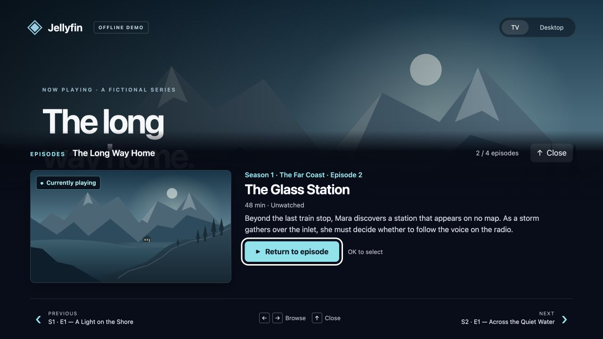
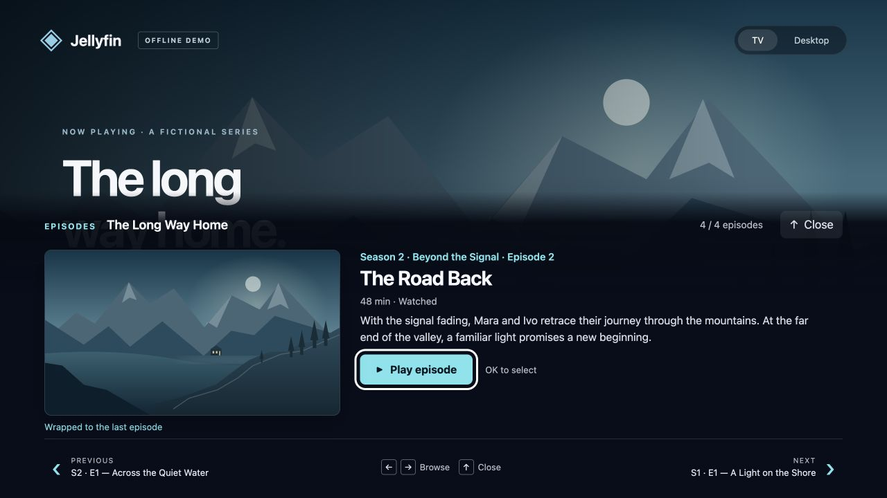
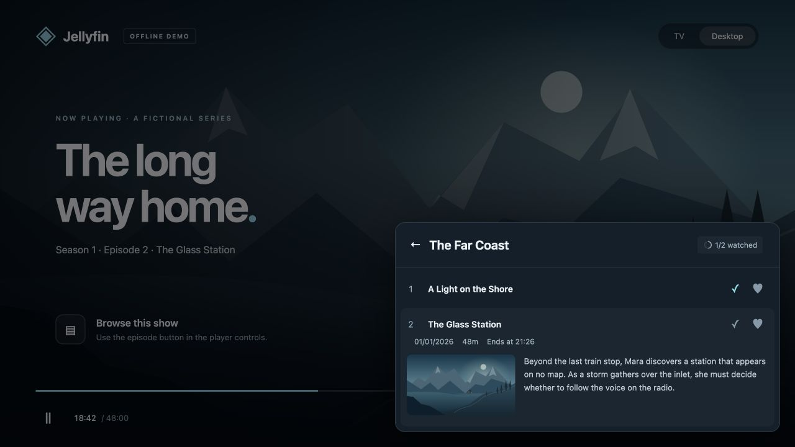

<p align="center">
  
</p>

# In Player Episode Preview — TV Edition

Browse every episode of a show without leaving the Jellyfin player. Open a remote-friendly panel, move between episodes and seasons, and keep your place in the video.

Inspired by and based on [Namo2's InPlayerEpisodePreview](https://github.com/Namo2/InPlayerEpisodePreview), this independent fork adds a TV interface while retaining the original desktop and mobile preview. It is maintained separately from the upstream project and is not an official upstream release.

[Download the latest release](https://github.com/jampez77/InPlayerEpisodePreview-TV/releases/latest) · [Report an issue](https://github.com/jampez77/InPlayerEpisodePreview-TV/issues) · [Original project](https://github.com/Namo2/InPlayerEpisodePreview)



*TV layout. All screenshots use fictional shows, episodes, and local demo artwork.*

## Browse with your remote

| Control | Action |
| --- | --- |
| **Down** | Open the episode browser on the playing episode. |
| **Left / Right** | Browse previous / next episodes, moving across seasons automatically. |
| **Up**, **Back**, or **Escape** | Close the browser and return to the player. |
| **OK / Enter** | Play or resume the selected episode. Selecting the playing episode returns to it. |

Each selection shows the series, season number and name, episode number and title, description, thumbnail, watch progress, and neighboring episodes. Browsing leaves playback running, and the existing spoiler-blur settings apply.

Seasons form one continuous list. Moving past the final episode wraps to the first, and moving back from the first wraps to the last. An on-screen message makes the transition clear. Specials appear first as Season 0; unavailable virtual episodes are omitted. A show with one episode stays on that episode.



*Whole-show wrapping in the fictional demo.*

TV mode follows Jellyfin's **Display → Layout → TV** setting. The player button is hidden in TV mode; desktop and mobile layouts keep the original **Episode Preview** button and popup.



*Desktop layout with the original player button and episode preview.*

## Compatibility

This is a **Jellyfin server plugin that extends Jellyfin Web**. The TV interface works in clients using the server's web player, including Jellyfin Media Player with the TV layout selected. It does not add a panel to independently implemented native players, such as the native Android TV player.

| Jellyfin server | Release package target | Build framework |
| --- | --- | --- |
| 10.10.7 | 10.10.7 | .NET 8 |
| 10.11.x | 10.11.0 | .NET 9 |
| 12.x | 12.0 / 12.0.0 | .NET 10 |

Builds cover these three server targets. Automated browser tests use a simulated Jellyfin API; live-server and physical-remote testing remains outstanding. When reporting a problem, include the server version, client, layout setting, and steps to reproduce it.

## Install

### Through Jellyfin's plugin catalogue

Add the following repository URL in the Jellyfin dashboard's plugin repository settings:

```text
https://raw.githubusercontent.com/jampez77/InPlayerEpisodePreview-TV/main/manifest.json
```

Open the plugin catalogue and install **InPlayerEpisodePreview** from the TV Edition repository (owner **jampez77**, with the new cyan episode-card logo), then restart Jellyfin. Reload the web client, select the TV layout, start an episode, and press **Down**.

**Replacing the original plugin:** this fork keeps the original plugin ID and settings. Install it as a replacement, not alongside a second copy. Use the TV Edition repository as the update source for this plugin and remove the original InPlayerEpisodePreview repository from your repository list to avoid competing updates. Back up your existing plugin folder before switching.

The inherited integration supports the [File Transformation plugin](https://github.com/IAmParadox27/jellyfin-plugin-file-transformation), which is recommended for loading the web script without directly modifying Jellyfin's `index.html`.

### Manual installation

1. Download the ZIP matching your server from [Releases](https://github.com/jampez77/InPlayerEpisodePreview-TV/releases/latest).
2. Stop Jellyfin and back up any existing InPlayerEpisodePreview plugin folder.
3. Extract `Namo.Plugin.InPlayerEpisodePreview.dll` into a folder under Jellyfin's configured `plugins` directory. Replace the existing plugin DLL if installed; do not leave two copies.
4. Restart Jellyfin and reload the web client. Choose the TV layout, start an episode, and press **Down**.

The release ZIPs contain the plugin DLL. The assembly name remains unchanged for compatibility with the original plugin.

## Build and verify

Requires Node.js 22+, npm, Python 3 for packaging, and a .NET SDK supporting the server target above. The .NET 10 SDK can build all three targets.

```sh
git clone https://github.com/jampez77/InPlayerEpisodePreview-TV.git
cd InPlayerEpisodePreview-TV/Namo.Plugin.InPlayerEpisodePreview
npm ci
npm run typecheck
npm test
npx playwright install chromium
npm run test:browser
cd ..

# Creates the ZIP in dist/; 10.11.0 is also the default if omitted.
bash scripts/package-plugin.sh 10.11.0

# Other supported targets:
bash scripts/package-plugin.sh 10.10.7
bash scripts/package-plugin.sh 12.0.0
```

`Web/InPlayerPreview.js` is the generated production bundle embedded in the DLL. Run `npm run build` from the project directory after editing TypeScript or CSS. For a development bundle with a separate source map, run `npx webpack --mode development`.

Tests cover episode pagination and ordering, season transitions, whole-show wrapping, remote and keyboard commands, playback errors, dialog and focus handling, asynchronous cancellation, and the desktop button.

## Try the UI locally

From the cloned repository:

```sh
cd Namo.Plugin.InPlayerEpisodePreview
npm ci
npm run build
npm run demo
```

Open the [TV demo](http://127.0.0.1:4173/demo/index.html#/video) and press **Down**, or open the [desktop demo](http://127.0.0.1:4173/demo/index.html?layout=desktop#/video) and click **Episode Preview**. The controls at the top also switch layouts.

The demo uses fictional content and local artwork. It runs the actual browser bundle against a simulated API; it does not connect to a Jellyfin server or play real video. See the [demo guide](Namo.Plugin.InPlayerEpisodePreview/demo/README.md) for test scenarios.

## Credits and license

The original **InPlayerEpisodePreview** plugin was created by [Namo2 and contributors](https://github.com/Namo2/InPlayerEpisodePreview). Their server integration, settings, episode data handling, and desktop preview provide the foundation for this project. This fork began from upstream commit [`015c57b`](https://github.com/Namo2/InPlayerEpisodePreview/commit/015c57b).

TV Edition adds remote navigation, a TV episode panel, continuous browsing across seasons, whole-show wrapping, and its accompanying demo and regression tests. The TV Edition logo and screenshots identify this fork; the original project's identity and authorship remain credited.

Distributed under the original [MIT license](LICENSE.md). The upstream license and copyright notice are preserved.
